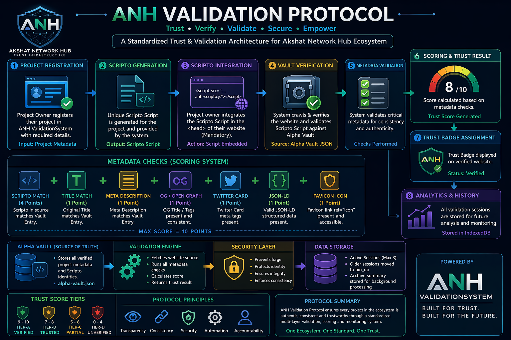
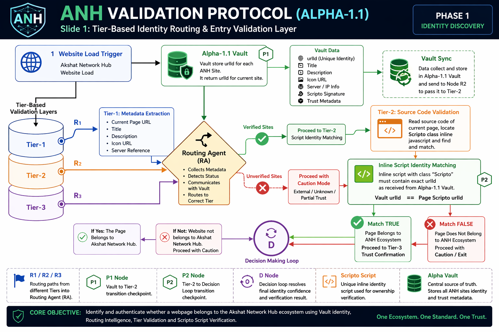
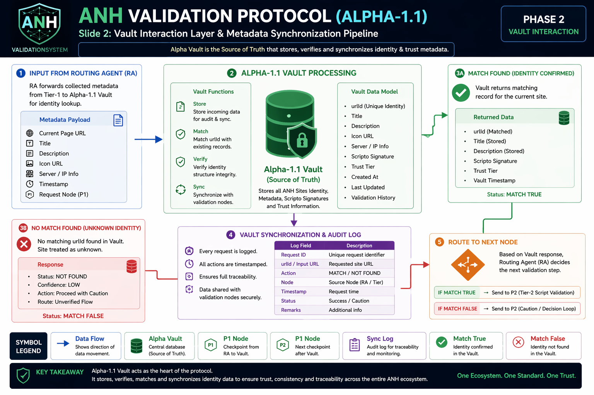
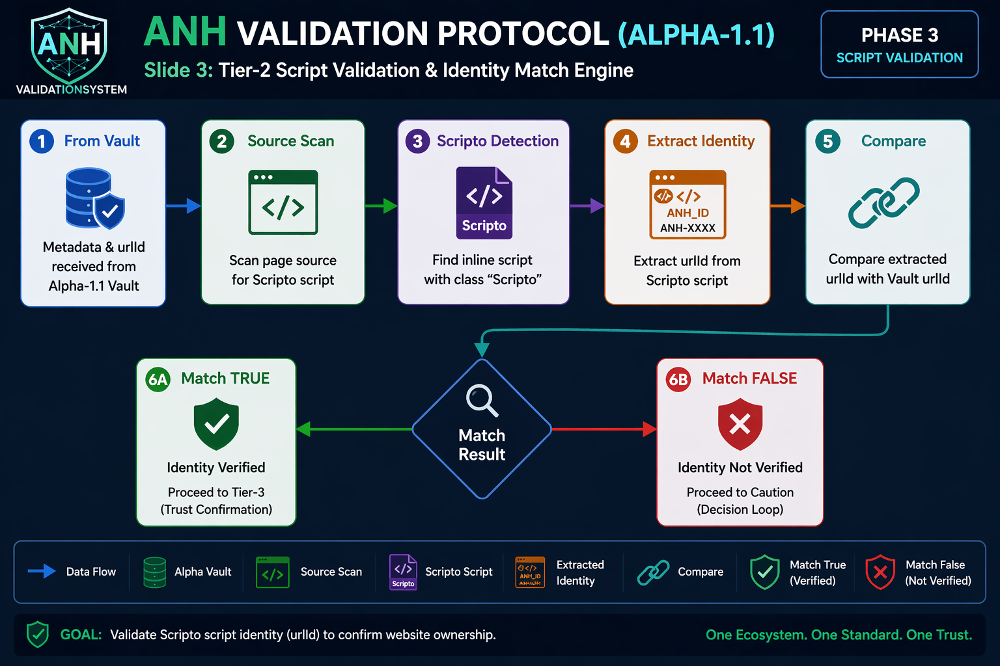
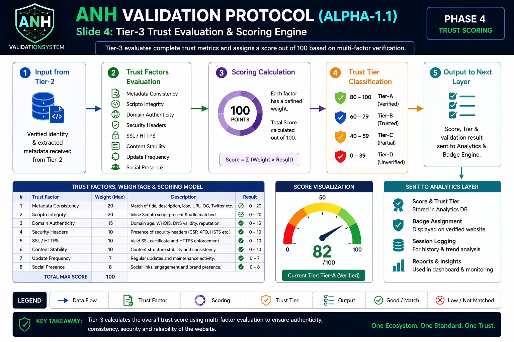

# ValidationSystem
ValidationSystem is a lightweight JavaScript-based multi-tier validation framework for the Akshat Network Hub ecosystem. It generates Scripto identity scripts for webpages, maintains Alpha-1.1 Vault metadata, and runs a routing-based verification engine that confirms trusted ANH pages through Tier-1, Tier-2, and decision loop validation logic.

---

<p align="center">


&nbsp;&nbsp;&nbsp;

&nbsp;&nbsp;&nbsp;


</p>

<h1 align="center">ANH ValidationSystem</h1>

<p align="center">
<b>Alpha Runtime Validator + Trust Badge Engine + Vault-Based Identity Protocol</b><br>
A lightweight, client-side trust verification architecture for static websites.
</p>

---

## 🚀 Overview

The <b>ANH ValidationSystem</b> is a <mark>multi-layer verification framework</mark> designed to ensure:

* 🔐 Page identity authenticity
* 📊 Metadata integrity
* 🧠 Vault-based trust validation
* 🏷 Runtime badge injection
* 🧩 Cross-site verification control

It works entirely on the <b>client-side</b>, making it ideal for static hosting platforms like GitHub Pages.

---

## 🧠 Architecture

<p align="center">

</p>

### Core Layers

| Layer             | Description                                |
| ----------------- | ------------------------------------------ |
| 🧭 Routing Layer  | Extracts metadata & initializes validation |
| 🗄 Vault Layer    | Central JSON registry of trusted entries   |
| 🧾 Scripto Engine | Inline identity signature validation       |
| ⚖ Trust Engine    | Tier-based scoring & badge rendering       |

---

## 🧩 System Components

<div align="center">

<table>
<tr>
<td width="300">

### 🔧 Generator

Create Scripto script + Vault entry

<a href="https://akshat-145609.github.io/ValidationSystem/">
<br>
<b>Open Generator</b>
</a>

</td>

<td width="300">

### 🔍 Inspector

Validate any ANH-enabled site

<a href="https://akshat-145609.github.io/ValidationSystem/inspector.htm">
<br>
<b>Open Inspector</b>
</a>

</td>

<td width="300">

### 📊 Analytics

Session-based scoring dashboard

<a href="https://akshat-145609.github.io/ValidationSystem/analytics/index.htm">
<br>
<b>Open Dashboard</b>
</a>

</td>
</tr>
</table>

</div>

---

## ⚙️ How It Works

```javascript
// Example Scripto Block
<script class="Scripto">

window.ANH_ID="ANH-XXXXXXX"

window.ANH_META={
url:"https://example.com",
title:"Example Page",
description:"Description",
icon:"/icon.png"
}

</script>
```

### Validation Flow

1. Extract Scripto metadata
2. Fetch Alpha Vault JSON
3. Match `urlId`
4. Validate metadata (strict match)
5. Apply rendering policy (iframe/domain check)
6. Inject trust badge

---

## 🛡 Security Model

* ✔ Strict metadata comparison
* ✔ Vault identity mapping
* ✔ Iframe/domain enforcement
* ✔ CSP-compatible architecture
* ✔ Runtime tamper detection

---

## 📊 Trust Badge Preview

<p align="center">
<br>
<i>Dynamic badge injected at runtime based on validation result</i>
</p>

---

## 📘 User Manual

### 🔹 Step 1 — Generate Identity

➡️ Visit Generator
Create:

* Scripto Script
* Vault JSON Entry

---

### 🔹 Step 2 — Embed Script

Paste inside `<head>`:

```html
<script class="Scripto">
...
</script>
```

---

### 🔹 Step 3 — Add Validator

```html
<script src="https://akshat-145609.github.io/ValidationSystem/scripts/anh-validator.js"></script>
```

---

### 🔹 Step 4 — Deploy

Add Vault JSON block to `https://akshat-145609.github.io/ValidationSystem/vault/alpha-vault.json`

---

### 🔹 Step 5 - Deploy

Upload new changes to server or Commit new chages by `git add .` -->  `git commit -m "Add Scripto Layer"` --> `git push origin main`

### 🔹 Step 6 — Verify

Open page → Trust badge appears automatically ✅

---

## 📸 Documentation Slides

<p align="center">



</p>

---

## 🎨 Visual UI (Optional CSS Cards)

```html
<style>
.card{
background:#0f172a;
padding:20px;
border-radius:12px;
transition:.3s;
}
.card:hover{
transform:translateY(-6px);
box-shadow:0 10px 30px rgba(0,0,0,.3);
}
</style>
```

---

## 🔗 Important Links

* 🌐 Portfolio
  https://akshat-145609.github.io/MyPortfolioSite/

* 📘 Medium Article
  https://medium.com/@its.akshatnetworkhub23/building-a-lightweight-page-identity-trust-system-for-static-websites-b2c0fb9b2a90

* 💻 GitHub Repository
  https://github.com/Akshat-145609/ValidationSystem

* 💼 LinkedIn
  https://www.linkedin.com/in/akshat-network-hub/

---

## ⚠️ Limitations

* Client-side only (no server verification)
* CSP headers recommended for full protection
* Cannot fully block iframe without server headers

---

## 🚀 Future Enhancements

* 🔐 Cryptographic signatures
* 🌍 Domain whitelist from vault
* 📦 ZIP fingerprint validation
* ⚡ Real-time analytics engine

---

## 📜 License

This project is part of <b>Akshat Network Hub</b> ecosystem.

---

<p align="center">
<b>Made with ❤️ for Secure Web Identity</b>
</p>

---
